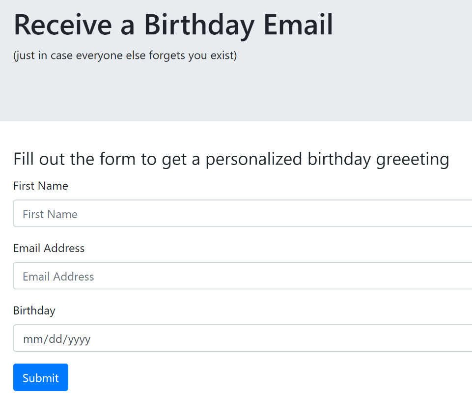

# Birthday-Email

Send yourself a birthday greeting by simply providing your name, email and birthdate.  



The project requires access to an email account from which the birthday messages are sent.  If Gmail is used, be sure to turn on the setting for "Allow less secure apps."  Gmail's security structure prevents it from being a good choice for production, but it will work for testing and development.

The cron job will work in development, but it may need to be adapted based on the production environment as there may be other ways of setting up scheduled events.

## Setup

```{
  "test": {
    "PORT": 3000,
    "MONGODB_URI": "mongodb://localhost:27017/BirthdayEmailTest",
    "EMAILUSER": "...",
    "EMAILPASSWORD": "...",
    "TESTMAILUSER": "...",
    "TESTMAILPASSWORD": "..."
  },
  "development": {
    "PORT": 3000,
    "MONGODB_URI": "mongodb://localhost:27017/BirthdayEmail",
    "EMAILUSER": "...",
    "EMAILPASSWORD": "...",
    "TESTMAILUSER": "...",
    "TESTMAILPASSWORD": "..."
  }
}```


The code for the form layout can be found at https://github.com/archer920/NodeIntroduction
